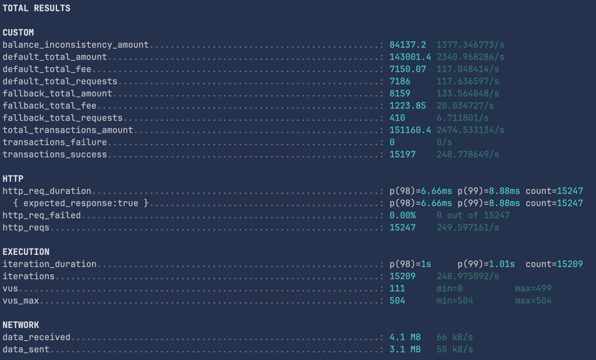
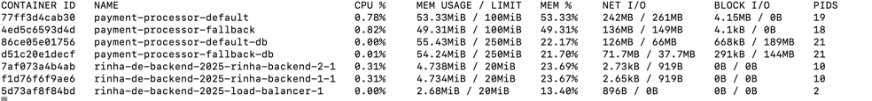

# Rinha de Backend 2025 - Java 24 + GraalVM

## Tecnologias Utilizadas

- **Java 25** com GraalVM
- **Nginx** como load balancer
- **Java HTTP Server** nativo (sem frameworks)

## Resultado rodando em Mac m3 16gb

##### Resultado dos testes

##### Consumo de recursos

